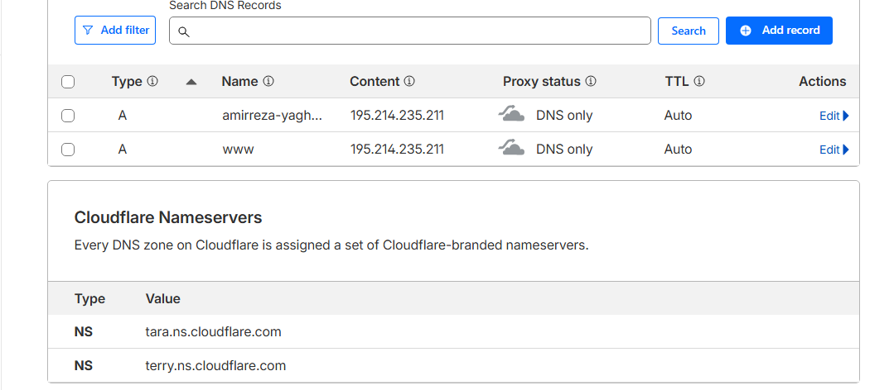
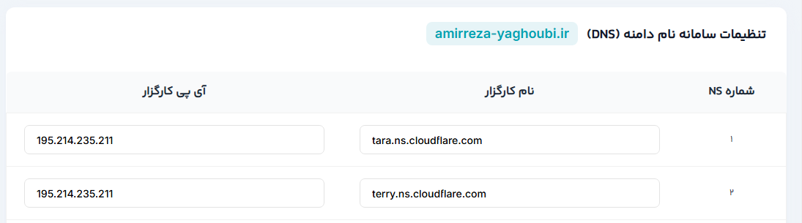

# پروژه پایانی درس پایگاه داده پیشرفته (Advanced Database)
## پیاده‌سازی و استقرار وب‌سرویس (هاویرکشت)

---

### مشخصات دانشجو
* **نام و نام خانوادگی:** امیررضا یعقوبی زاده
* **شماره دانشجویی:** [40411415021]
* **استاد مربوطه:** دکتر آرمین رشنو
* **نیم‌سال تحصیلی:** پاییز 1404

---

### مقدمه (Introduction)
در این پروژه، یک وب‌سرویس جامع مبتنی بر فریم‌ورک **Django** و **Django REST Framework (DRF)** طراحی و پیاده‌سازی شده است. این سامانه وظیفه مدیریت داده‌ها و ارائه عملیات مرتبط با پایگاه داده را به‌صورت API در بستر وب بر عهده دارد. 

نسخه فعلی بر اساس مدل مفهومی پروژه تجاری **«هاویرکشت»** توسعه یافته که با هدف مکانیزاسیون و هوشمندسازی فرآیندهای کشاورزی طراحی شده است. اهداف کلیدی این پروژه فراتر از کدنویسی صرف بوده و موارد زیر را در بر می‌گیرد:
* **طراحی دیتابیس:** پیاده‌سازی دقیق جداول بر اساس نمودار ERD استاندارد.
* **توسعه API:** ایجاد نقاط دسترسی (Endpoints) برای تعامل با داده‌ها.
* **استقرار (Deployment):** مدیریت سرور، تنظیم دامنه و فعال‌سازی پروتکل امنیتی SSL.
* **یکپارچه‌سازی مستمر (CI/CD):** اتوماتیک‌سازی فرآیند تست و انتشار با استفاده از GitHub Actions.
* **آشنایی با مدیریت سرور های لینوکسی:** تهیه سرور و بروزرسانی و مدیریت پروژه روی سرور.
* **آشنایی با Cloudflare:** اتصال دامنه با پسوند .ir به Cloudflare.

---

### تکنولوژی‌ها و ابزارهای مورد استفاده (Tech Stack)

در توسعه و استقرار این پروژه از مجموعه‌ای از ابزارهای بروز و استاندارد صنعت نرم‌افزار استفاده شده است تا پایداری، امنیت و توسعه‌پذیری سیستم تضمین شود:

* **Backend Framework:** * **Django:** فریم‌ورک اصلی جهت توسعه سریع و امن.
    * **Django REST Framework (DRF):** جهت طراحی و پیاده‌سازی APIهای RESTful.

* **Database:**
    * **PostgreSQL:** پایگاه داده رابطه‌ای قدرتمند برای مدیریت داده‌های پروژه هاویرکشت.

* **Authentication:**
    * **JWT (JSON Web Token):** جهت احراز هویت امن و مدیریت نشست‌های کاربران در API.

* **Documentation:**
    * **Swagger (drf-spectacular/drf-yasg):** جهت مستندسازی خودکار و تست آنلاین Endpointها.

* **Version Control:**
    * **Git & GitHub:** مدیریت نسخه‌های کد و همکاری در پروژه.

* **Containerization:**
    * **Docker & Docker Compose:** جهت کانتینرایز کردن اپلیکیشن و دیتابیس برای یکپارچگی محیط توسعه و تولید.

* **Infrastructure & Deployment:**
    * **Linux VPS:** میزبانی پروژه بر روی سرور مجازی با سیستم‌عامل لینوکس (Ubuntu).
    * **Cloudflare:** جهت مدیریت DNS، افزایش امنیت و فعال‌سازی پروتکل SSL/TLS.

---

### مراحل پیاده‌سازی پروژه (Implementation Steps)

فرآیند توسعه این پروژه در چندین گام اساسی و به صورت متدولوژی گام‌به‌گام انجام شده است:

#### ۱. تحلیل و بررسی APIهای مرجع
در مرحله نخست، به منظور درک دقیق ساختار داده‌ها و روابط بین موجودیت‌ها، APIهای نسخه آموزشی پروژه **هاویرکشت** مورد تحلیل قرار گرفت. در این مرحله، مستندات Swagger پروژه مرجع در بخش‌های زیر بررسی و تست گردید:
* **User & Auth:** مدیریت کاربران و احراز هویت.
* **Location Management:** بررسی ساختار تقسیمات کشوری شامل استان (Province)، شهر (City) و روستا (Village).
* **آدرس مرجع:** [https://edu-api.havirkesht.ir/docs](https://edu-api.havirkesht.ir/docs)

#### ۲. طراحی و پیاده‌سازی مدل‌های دیتابیس (Database Modeling)
پس از تحلیل، مدل‌های دیتابیس در Django بر اساس معماری پایگاه داده‌های رابطه‌ای طراحی شدند. در این پیاده‌سازی، روابط `ForeignKey` برای برقراری ارتباط بین جداول و رعایت نرمال‌سازی استفاده شده است.

**کد پیاده‌سازی مدل‌ها:**

```python
from django.db import models
from django.contrib.auth.models import AbstractUser
from django_jalali.db import models as jmodels

# مدل نقش‌ها جهت مدیریت سطوح دسترسی
class Role(models.Model):
    name = models.CharField(max_length=50, unique=True)
    scope = models.TextField()
    created_at = jmodels.jDateTimeField(auto_now_add=True)
    updated_at = jmodels.jDateTimeField(auto_now=True)

    def __str__(self):
        return self.name

    class Meta:
        ordering = ["name"]
        verbose_name = "نقش"
        verbose_name_plural = "نقش‌ها"

# مدل کاربر سفارشی‌سازی شده با فیلد تلفن و نقش
class User(AbstractUser):
    phone = models.CharField(max_length=15, unique=True, null=True, blank=True)
    role = models.ForeignKey(Role, on_delete=models.SET_NULL, null=True, blank=True)
    created_at = jmodels.jDateTimeField(auto_now_add=True)
    updated_at = jmodels.jDateTimeField(auto_now=True)

    def __str__(self):
        return self.username

    class Meta:
        ordering = ["-created_at"]
        verbose_name = "کاربر"
        verbose_name_plural = "کاربران"

# مدل‌های تقسیمات جغرافیایی (استان، شهر، روستا)
class Province(models.Model):
    name = models.CharField(max_length=100)
    created_at = jmodels.jDateTimeField(auto_now_add=True)
    updated_at = jmodels.jDateTimeField(auto_now=True)

    def __str__(self):
        return self.name

class City(models.Model):
    name = models.CharField(max_length=100)
    province = models.ForeignKey(Province, on_delete=models.CASCADE, related_name="cities")
    created_at = jmodels.jDateTimeField(auto_now_add=True)
    updated_at = jmodels.jDateTimeField(auto_now=True)

    def __str__(self):
        return f"{self.name}, {self.province.name}"

class Village(models.Model):
    name = models.CharField(max_length=100)
    city = models.ForeignKey(City, on_delete=models.CASCADE, related_name="villages")
    created_at = jmodels.jDateTimeField(auto_now_add=True)
    updated_at = jmodels.jDateTimeField(auto_now=True)

    def __str__(self):
        return f"{self.name}, {self.city.name}"

```

#### ۳. پیاده‌سازی نقاط دسترسی (API Endpoints)
در این مرحله، عملیات CRUD و مدیریت کاربران با استفاده از **Django REST Framework** پیاده‌سازی شد. امنیت سیستم از طریق احراز هویت **JWT** تامین شده و سطوح دسترسی (Permissions) به دقت برای هر متد تنظیم گردیده است.

##### الف) مدیریت کاربران و احراز هویت (Auth & Users)
برای مدیریت ورود، خروج و تغییر رمز عبور، از کلاس‌های استاندارد DRF و SimpleJWT استفاده شده است:

```python
# احراز هویت و مدیریت توکن‌ها
class LoginView(TokenObtainPairView):
    """ دریافت توکن JWT """
    pass

class RefreshTokenView(TokenRefreshView):
    """ تمدید اعتبار توکن """
    pass

class LogoutView(APIView):
    """ خروج از حساب کاربری و ابطال توکن (Blacklist) """
    permission_classes = [IsAuthenticated]
    authentication_classes = [JWTAuthentication]

    def post(self, request):
        try:
            refresh_token = request.data["refresh"]
            token = RefreshToken(refresh_token)
            token.blacklist()
            return Response(status=status.HTTP_205_RESET_CONTENT)
        except Exception as e:
            return Response(status=status.HTTP_400_BAD_REQUEST)

# مدیریت اطلاعات کاربران
class UserListView(generics.ListAPIView):
    queryset = User.objects.all()
    serializer_class = UserSerializer
    permission_classes = [IsAuthenticated]
    authentication_classes = [JWTAuthentication]

class ChangePasswordView(APIView):
    """ تغییر رمز عبور کاربر جاری """
    authentication_classes = [JWTAuthentication]
    permission_classes = [IsAuthenticated]

    def post(self, request):
        serializer = UserChangePasswordSerializer(data=request.data, context={"request": request})
        if serializer.is_valid():
            user = request.user
            user.set_password(serializer.validated_data["new_password"])
            user.save()
            return Response({"message": "رمز عبور با موفقیت تغییر یافت."})
        return Response(serializer.errors, status=status.HTTP_400_BAD_REQUEST)
```

#### ب) مدیریت تقسیمات جغرافیایی (Location APIs)

در این بخش، نقاط دسترسی مربوط به اطلاعات جغرافیایی پروژه **هاویرکشت** پیاده‌سازی شده است. این APIها به کاربران احراز هویت شده اجازه می‌دهند تا لیست استان‌ها، شهرها و روستاها را مشاهده کرده و یا موارد جدیدی را ثبت و حذف نمایند. ساختار این بخش به گونه‌ای طراحی شده که سلسله‌مراتب دیتابیس (استان -> شهر -> روستا) در پاسخ‌های API کاملاً حفظ شود.


##### جدول نقاط دسترسی (Endpoints Table)

| موجودیت | عملیات (Methods) | آدرس (Endpoint) | دسترسی |
| :--- | :--- | :--- | :--- |
| **استان** | GET, POST | `/api/provinces/` | IsAuthenticated |
| **استان** | DELETE | `/api/provinces/<int:pk>/` | IsAuthenticated |
| **شهر** | GET, POST | `/api/cities/` | IsAuthenticated |
| **شهر** | DELETE | `/api/cities/<int:pk>/` | IsAuthenticated |
| **روستا** | GET, POST | `/api/villages/` | IsAuthenticated |
| **روستا** | DELETE | `/api/villages/<int:pk>/` | IsAuthenticated |

##### نمونه پیاده‌سازی لایه View
کد زیر نحوه تعامل با مدل‌های جغرافیایی و مدیریت عملیات حذف و نمایش را نشان می‌دهد:

```python
# مدیریت استان‌ها
class ProvinceListCreateView(ListCreateAPIView):
    queryset = Province.objects.all()
    permission_classes = [IsAuthenticated]
    serializer_class = ProvinceSerializer

class ProvinceDeleteView(DestroyAPIView):
    queryset = Province.objects.all()
    permission_classes = [IsAuthenticated]
    serializer_class = ProvinceSerializer

    def delete(self, request, *args, **kwargs):
        province = self.get_object()
        province.delete()
        return Response(
            {"message": "Province deleted successfully."},
            status=status.HTTP_204_NO_CONTENT,
        )

# مدیریت شهرها
class CityListCreateView(ListCreateAPIView):
    queryset = City.objects.all()
    permission_classes = [IsAuthenticated]
    serializer_class = CitySerializer

class CityDeleteView(DestroyAPIView):
    queryset = City.objects.all()
    permission_classes = [IsAuthenticated]
    serializer_class = CitySerializer

    def delete(self, request, *args, **kwargs):
        city = self.get_object()
        city.delete()
        return Response(
            {"message": "City deleted successfully."},
            status=status.HTTP_204_NO_CONTENT,
        )

# مدیریت روستاها
class VillageListCreateView(ListCreateAPIView):
    queryset = Village.objects.all()
    permission_classes = [IsAuthenticated]
    serializer_class = VillageSerializer

class VillageDeleteView(DestroyAPIView):
    queryset = Village.objects.all()
    permission_classes = [IsAuthenticated]
    serializer_class = VillageSerializer

    def delete(self, request, *args, **kwargs):
        village = self.get_object()
        village.delete()
        return Response(
            {"message": "Village deleted successfully."},
            status=status.HTTP_204_NO_CONTENT,
        )

```

---

#### ۴. مدیریت دامنه و تنظیمات DNS (Cloudflare & IRNIC)

برای دسترس‌پذیری وب‌سرویس بر روی شبکه اینترنت و بهره‌مندی از قابلیت‌های امنیتی، مراحل زیر انجام شد:

1.  **ثبت دامنه:** یک دامنه اختصاصی با پسوند `.ir` از طریق کارگزاری **IRNIC** ثبت گردید.
2.  **انتقال DNS:** جهت مدیریت بهینه و استفاده از سرویس‌های امنیتی و CDN، مدیریت DNSهای دامنه به **Cloudflare** منتقل شد.
3.  **تنظیمات رکوردها:** رکوردهای مورد نیاز برای اتصال دامنه به **VPS** (از نوع A Record) در پنل کلودفلر تعریف شد.

##### پیکربندی DNS در پنل Cloudflare
در تصویر زیر، نحوه تعریف رکوردها و فعال‌سازی حالت **Proxy** برای محافظت از IP سرور و فعال‌سازی SSL رایگان مشاهده می‌شود:





---

### ۵. آماده‌سازی سرور مجازی (VPS) و نصب پیش‌نیازها

پس از تهیه سرور مجازی با سیستم‌عامل **Ubuntu**، فرآیند آماده‌سازی زیرساخت برای میزبانی پروژه انجام شد. این مرحله شامل پیکربندی امنیتی، بروزرسانی پکیج‌ها و نصب ابزارهای مورد نیاز برای اجرای کانتینرها است.

#### ۵.۱. بروزرسانی مخازن و پکیج‌های سیستم
در اولین گام، برای اطمینان از پایداری و امنیت سرور، تمامی پکیج‌های سیستم به آخرین نسخه بروزرسانی شدند:

```bash
sudo apt update && sudo apt upgrade -y
```

#### ۵.۲. نصب پلتفرم Docker و Docker Compose

با توجه به اینکه پروژه به صورت کانتینرایز شده مستقر می‌شود، نصب موتور داکر و ابزار مدیریت کامپوز ضروری است:

```bash
# نصب موتور داکر
sudo apt install docker.io -y

# فعال‌سازی و تنظیم اجرای خودکار داکر پس از بوت سرور
sudo systemctl start docker
sudo systemctl enable docker

# نصب داکر کامپوز برای مدیریت چند کانتینر به صورت همزمان
sudo apt install docker-compose -y
```

#### ۵.۳. نصب ابزارهای مدیریت نسخه و پایگاه داده
برای دریافت کدها از مخزن گیت‌هاب و مدیریت جانبی پایگاه داده، ابزارهای زیر نصب شدند:

```bash
# نصب Git جهت Clone کردن پروژه
sudo apt install git -y

# نصب کلاینت PostgreSQL جهت تست ارتباط با دیتابیس در صورت نیاز
sudo apt install postgresql-client -y
```

#### ۵.۴. پیکربندی امنیتی (Firewall)
برای محافظت از سرور، دسترسی به پورت‌های غیرضروری مسدود شده و تنها پورت‌های حیاتی باز شدند:

```bash
# اجازه دسترسی به SSH برای مدیریت سرور
sudo ufw allow OpenSSH

# باز کردن پورت‌های وب برای پروتکل‌های HTTP و HTTPS
sudo ufw allow 80/tcp
sudo ufw allow 443/tcp

# فعال‌سازی فایروال
sudo ufw enable
```

---

### ۶. کلون کردن پروژه روی سرور (Deployment)

پس از آماده‌سازی زیرساخت، کدهای پروژه از مخزن گیت‌هاب به سرور منتقل شد. این کار با استفاده از پروتکل Git انجام می‌گیرد تا همواره امکان دریافت آخرین تغییرات فراهم باشد.

```bash
# رفتن به پوشه خانگی یا پوشه دلخواه برای استقرار
cd /var/www

# کلون کردن پروژه از گیت‌هاب (آدرس پروژه خود را جایگزین کنید)
git clone [https://github.com/amir-y-17/Advanced-DB-project.git](https://github.com/amir-y-17/Advanced-DB-project.git)

```bash
# ورود به پوشه پروژه
cd  Advanced-DB-project
```

---

### ۷. راه‌اندازی پروژه با Docker Compose
در این مرحله، تمامی سرویس‌های مورد نیاز پروژه (Django، PostgreSQL، Nginx) به صورت یکپارچه و در محیط Production اجرا می‌شوند. استفاده از فایل مخصوص prod باعث می‌شود تنظیمات امنیتی و دیتابیس واقعی اعمال گردد.

```bash
# اجرای کانتینرها در حالت Background (Detached)
docker-compose -f docker-compose.prod.yml up -d --build

# اجرای Migrationها برای ساخت جداول در دیتابیس سرور
docker-compose -f docker-compose.prod.yml exec web python manage.py migrate

# جمع‌آوری فایل‌های استاتیک
docker-compose -f docker-compose.prod.yml exec web python manage.py collectstatic --no-input
```

---

### ۸. دریافت گواهی امنیتی SSL با استفاده از Certbot
برای برقراری ارتباط امن (HTTPS) و رمزنگاری داده‌ها بین کاربر و سرور، از گواهی رایگان Let's Encrypt استفاده شد. ابزار Certbot وظیفه دریافت و تمدید خودکار این گواهی را بر عهده دارد.

```bash
# نصب Certbot و پلاگین مخصوص Nginx
sudo apt install certbot python3-certbot-nginx -y

# این دستور به صورت خودکار فایل تنظیمات Nginx را آپدیت می‌کند
sudo certbot --nginx -d amirreza-yaghoubi.ir -d www.amirreza-yaghoubi.ir

```

### ۹. یکپارچه‌سازی و استقرار مستمر (CI/CD) با GitHub Actions

به منظور تسریع در فرآیند توسعه و اطمینان از صحت استقرار کدهای جدید، از سرویس **GitHub Actions** استفاده شده است. با این رویکرد، هر بار که تغییری در شاخه اصلی (`main`) ثبت (Push) شود، فرآیند به‌روزرسانی سرور به صورت خودکار انجام می‌گردد.

#### تحلیل فرآیند Workflow
فایل پیکربندی طراحی شده شامل گام‌های زیر است:

1.  **Trigger:** گوش‌به‌زنگ بودن برای هرگونه `push` روی برنچ `main`.
2.  **Checkout:** واکشی آخرین نسخه کد از مخزن گیت‌هاب.
3.  **SSH Connection:** برقراری ارتباط امن با سرور از طریق کلیدهای SSH ذخیره شده در **GitHub Secrets**.
4.  **Remote Execution:** اجرای دستورات بر روی سرور شامل:
    * دریافت کدهای جدید (`git pull`).
    * بازسازی کانتینرها در صورت تغییر در Dockerfile یا پکیج‌ها.
    * اجرای خودکار Migrationها و جمع‌آوری فایل‌های Static.

#### کد پیکربندی (deploy.yml)

```yaml
name: Deploy to Server

on:
  push:
    branches:
      - main  

jobs:
  deploy:
    runs-on: ubuntu-latest

    steps:
      - name: Checkout code
        uses: actions/checkout@v3

      - name: Executing remote ssh commands to deploy
        uses: appleboy/ssh-action@master
        with:
          host: ${{ secrets.SERVER_IP }}
          username: ${{ secrets.SERVER_USER }}
          key: ${{ secrets.SSH_PRIVATE_KEY }}
          script: |
            cd ${{ secrets.PROJECT_PATH }}
            git pull origin main
            docker compose -f docker-compose.prod.yml up -d --build
            docker compose -f docker-compose.prod.yml exec -T backend python manage.py makemigrations
            docker compose -f docker-compose.prod.yml exec -T backend python manage.py migrate
            docker compose -f docker-compose.prod.yml exec -T backend python manage.py collectstatic --no-input
```

**امنیت در CI/CD**
برای رعایت اصول امنیتی، اطلاعات حساس سرور شامل آدرس IP، نام کاربری و کلید خصوصی SSH به صورت مستقیم در کد قرار داده نشده‌اند. این اطلاعات در بخش Secrets مخزن گیت‌هاب تعریف شده و با متغیرهایی مانند ${{ secrets.SERVER_IP }} فراخوانی می‌شوند.

مزیت این روش: حذف خطای انسانی در هنگام استقرار و تضمین اینکه نسخه روی سرور همیشه با آخرین نسخه کد در مخزن مطابقت دارد.

---

### سخن پایانی و جمع‌بندی

پروژه پیاده‌سازی و استقرار وب‌سرویس **هاویرکشت**، تجربه‌ای جامع در راستای تلفیق مفاهیم تئوریک درس پایگاه داده پیشرفته با نیازهای دنیای واقعی صنعت نرم‌افزار بود. در این پروژه، علاوه بر طراحی مدل‌های رابطه‌ای و مدیریت روابط پیچیده میان داده‌ها، چالش‌های عملیاتی در لایه‌های مختلف از جمله امنیت APIها، مدیریت سرور و خودکارسازی فرآیند انتشار (CI/CD) مورد بررسی و حل قرار گرفت.

این مستندات بازتاب‌دهنده تلاش برای رعایت استانداردهای مهندسی نرم‌افزار در تمامی مراحل توسعه است. امید است که زیرساخت ایجاد شده، بستری مناسب برای توسعه ویژگی‌های پیشرفته‌تر در نسخه‌های آتی این سامانه باشد.

از جناب **دکتر رشنو** بابت راهنمایی‌ها و ارائه سرفصل‌های کاربردی که منجر به اجرای این پروژه گردید، کمال تشکر را دارم.

---


**امیررضا یعقوبی زاده** **پاییز 1404**

**Project link :** https://www.amirreza-yaghoubi.ir/api/docs/